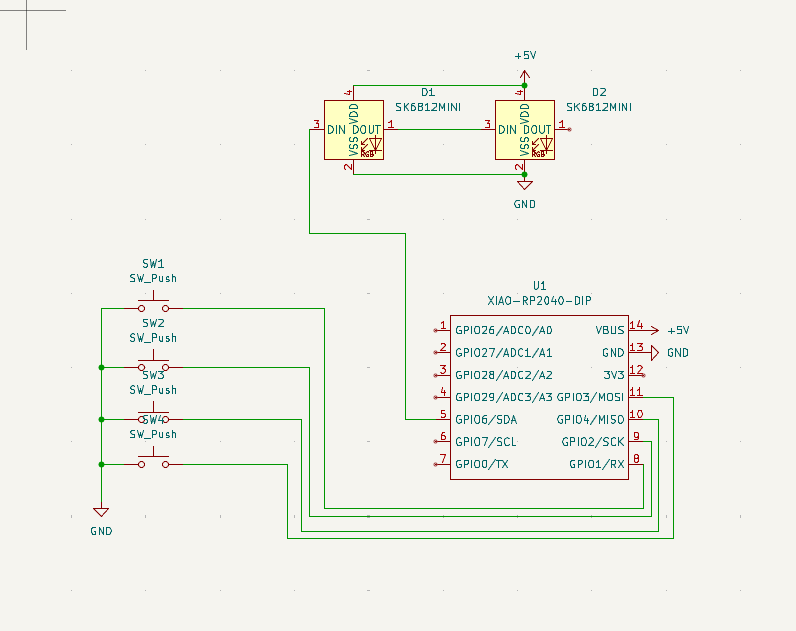

# Hackpad Project README

## Overview

This repository contains the complete design, documentation, and firmware for my hackpad project. Everything needed to understand, modify, or build the device is included through structured folders and clear visuals.

---

## Project Screenshots

### 1. Overall Hackpad

### 2. Schematic

### 3. PCB Layout

---

## Project Structure

This repository is divided into three main folders for clarity and ease of navigation:

### `/CAD`

* Contains a single file representing the **entire hackpad assembly**.
* Accepted formats: `.STEP`, `.STP`, `.3MF`.
* Should include the PCB model (a rectangular placeholder is acceptable) and all case parts.

### `/PCB`

* Contains all PCB design files.
* If using KiCAD, include:

  * `.kicadpro`
  * `.kicadsch`
  * `.kicad_pcb`

### `/Firmware`

* Contains all firmware source files.

---

## Bill of Materials (BOM)

List all components used in the project. Example format:

| Part                             | Quantity | Description                   | 
| -------------------------------- | -------- | ----------------------------- | 
| Seeed XIAO RP2040 (through-hole) | 1        | Main MCU                      | 
| Mechanical Switches              | 4        | Switches for input            | 
| Keycaps                          | 4        | Compatible with switches      | 
| PCB                              | 1        | Custom single layer PCB       | 
| 3D Printed Case Parts            | 2        | All printed components        | 

---

## How to Use This Repository

1. Clone the GitHub repo after creating it on your account
2. Drag your organized `CAD`, `PCB`, and `Firmware` folders into the repo
3. Add all screenshots required above into this README
4. Push changes to GitHub to finalize your submission

